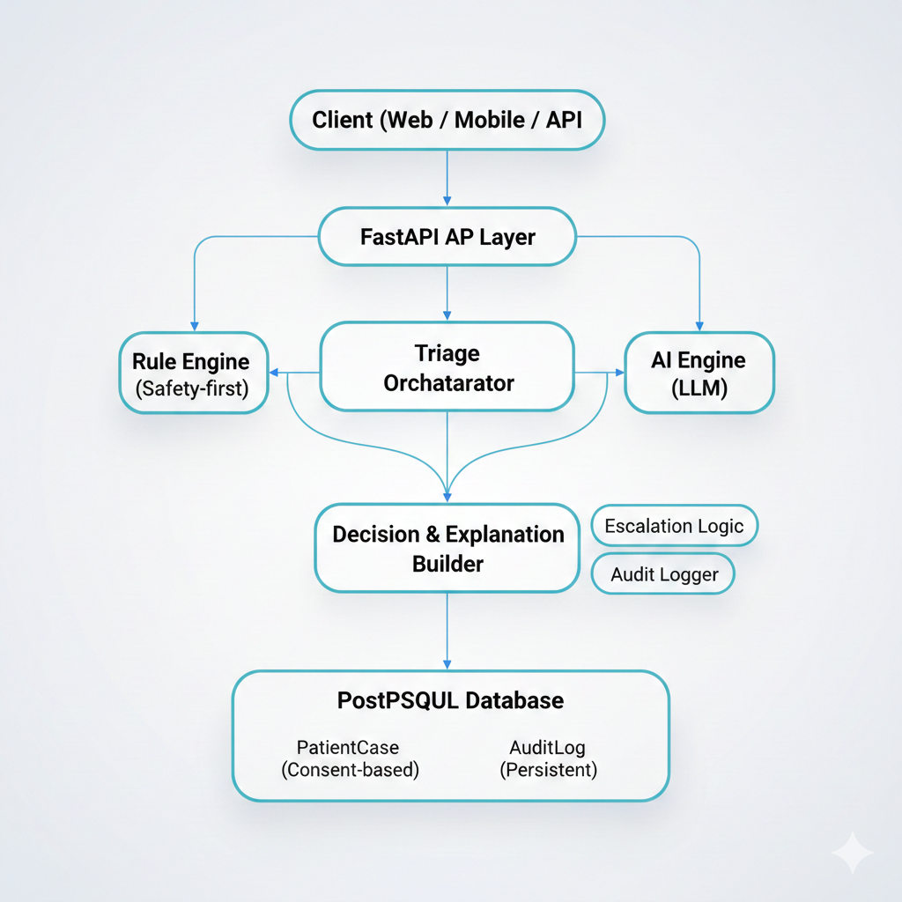

# WellMedica — Clinical AI Triage & Decision Support System

> A safety-first, explainable, hybrid clinical triage system combining rule-based medical logic with assistive AI for primary care decision support.

---

## Overview

ClinikAid (also referred to as WellMedica) is an **applied AI system** designed to assist in **clinical triage and preliminary decision support** for general healthcare settings (e.g., general practice, skin care, dental, primary clinics).

The system follows a **hybrid architecture**:

- ✅ **Rule-based engine** as the first line of safety (deterministic, explainable, offline-capable)
- 🤖 **AI-assisted reasoning** (LLM) used only when appropriate
- 🧾 **Audit logging & traceability** for every decision
- 🔐 **Consent-aware data storage** for privacy and compliance
- 🧠 **Explainable outputs** separated for clinical vs patient-facing messages

**Research motivation:**  
Explore how **hybrid AI systems** (rules + LLMs) can improve **safety, reliability, and explainability** in clinical decision support compared to AI-only approaches.

---

## Goals

- Build a **safe, explainable clinical triage system**
- Combine **deterministic medical rules + AI assistance**
- Provide **traceable, auditable decisions**
- Support **human-in-the-loop** clinical workflows
- Serve as a **research platform** for:
  - Hybrid AI systems
  - Clinical AI safety
  - Explainable AI (XAI)
  - ML systems in healthcare

---

## System Architecture (High Level)

# WellMedica — Clinical AI Triage & Decision Support System

> A safety-first, explainable, hybrid clinical triage system combining rule-based medical logic with assistive AI for primary care decision support.

---

## Overview

ClinikAid (also referred to as WellMedica) is an **applied AI system** designed to assist in **clinical triage and preliminary decision support** for general healthcare settings (e.g., general practice, skin care, dental, primary clinics).

The system follows a **hybrid architecture**:

- ✅ **Rule-based engine** as the first line of safety (deterministic, explainable, offline-capable)
- 🤖 **AI-assisted reasoning** (LLM) used only when appropriate
- 🧾 **Audit logging & traceability** for every decision
- 🔐 **Consent-aware data storage** for privacy and compliance
- 🧠 **Explainable outputs** separated for clinical vs patient-facing messages

**Research motivation:**  
Explore how **hybrid AI systems** (rules + LLMs) can improve **safety, reliability, and explainability** in clinical decision support compared to AI-only approaches.

---

## Goals

- Build a **safe, explainable clinical triage system**
- Combine **deterministic medical rules + AI assistance**
- Provide **traceable, auditable decisions**
- Support **human-in-the-loop** clinical workflows
- Serve as a **research platform** for:
  - Hybrid AI systems
  - Clinical AI safety
  - Explainable AI (XAI)
  - ML systems in healthcare

---

## System Architecture (High Level)




*Figure 1: High-level architecture of the hybrid clinical AI triage and decision support system.*

---

## Key Components

### 1️⃣ API Layer (FastAPI)
- Handles requests and input validation (Pydantic)
- Exposes endpoints for patient intake and future doctor/admin dashboards
- Clean separation between API and business logic

### 2️⃣ Rule-Based Triage Engine
- Keyword and symptom-based deterministic logic
- Returns:
  - Risk level (HIGH / MEDIUM / LOW)
  - Reason
  - Matched keyword
  - Source = rule_based
- Acts as **first safety gate**
- Works **offline** and is **fully explainable**

### 3️⃣ AI Engine (Assistive Only)
- Uses LLMs to refine recommendations **only when safe**
- Never overrides **HIGH-risk** rule-based decisions
- Fallbacks to rule-only logic if AI fails
- Used for:
  - Better explanations
  - More nuanced guidance
  - Language refinement

### 4️⃣ Decision & Safety Layer
- Adds:
  - `requires_review` flag for MEDIUM / HIGH risk
  - Patient-safe explanation text
  - Clinical recommendation text
- Supports **human-in-the-loop** workflows

### 5️⃣ Persistence Layer (PostgreSQL)
- **PatientCase table** (only if user consent is given)
- **AuditLog table** (always logged):
  - risk_level
  - rule_source
  - matched_keyword
  - ai_used
  - decision_text
  - timestamp

This ensures:
- Traceability
- Debugging
- Compliance
- Research evaluation
- Clinical accountability

---

## Ethics, Privacy & Safety

- If `consent = false`:
  - ❌ No patient data stored
  - ✅ Decision still returned
  - ✅ Audit log still recorded (anonymized if needed)
- AI is **assistive, not authoritative**
- Rule engine **always has priority for emergencies**
- Designed with **consent-first** and **safety-first** principles

---

## Research Directions

This system is designed as a **research platform** to study:

- Hybrid rule-based + AI clinical systems
- Safety and reliability of LLM-assisted decision support
- Explainability in medical AI
- Auditability and traceable AI pipelines
- Human-in-the-loop clinical workflows
- Evaluation of rule-only vs hybrid systems

Planned:
- Clinical expert feedback integration
- Comparative evaluation experiments
- Risk calibration and safety metrics
- Explainability scoring

---

## Tech Stack

- **Backend:** Python, FastAPI  
- **AI:** LLM APIs (pluggable: Gemini/OpenAI/etc.)  
- **Database:** PostgreSQL, SQLAlchemy  
- **Validation:** Pydantic  
- **Architecture:** Modular services (rule engine, triage engine, explanation builder)  
- **Dev Tools:** Git, Docker (planned)

---

## Project Structure


---

## How to Run (Basic)

```bash
git clone https://github.com/lalitakc9/well-medika-ai.git
cd well-medika-ai
pip install -r requirements.txt
uvicorn app.main:app --reload
